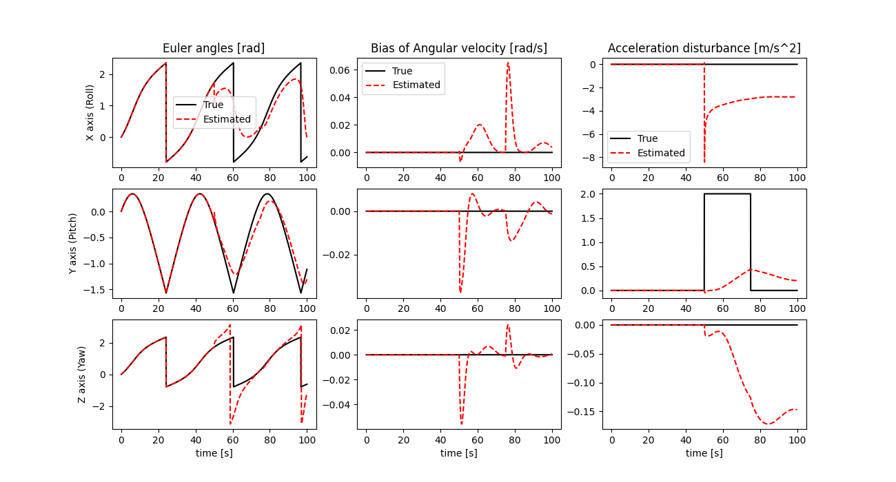

# 姿勢推定フィルタの実装

## アルゴリズム

参考文献[1]の”カルマンフィルタによる加速度外乱推定アルゴリズム”を実装．

数値的安定性を考慮して拡張カルマンフィルタをU-D分解フィルタとして実装しているが，U-D分解フィルタの部分の実装と動作が正しいことは他のシミュレーションで確認済み．間違っているとすればヤコビアンの部分だと思う．

## 実行方法

```sh
$ cargo run && python3 data_plot.py
```

## 実行結果

デバッグのためにとりあえず雑音無しでシミュレーション．



## 現状の問題点

加速度外乱がない状態での推定は上手くいっている．加速度外乱が入った場合も発散するようなことは無いが，参考文献[1]中に掲載されているシミュレーション結果とは程遠い．

パラメータを変更してもほとんど改善しないが，組み合わせが無数にあるのでどこに原因があるのか不明．ヤコビアンの実装が間違っている可能性もあり．

## 参考文献

1. 田原 誠, 鈴木 智, 野波 健蔵, ”小型軽量汎用性を特徴とする小型姿勢センサの開発”, 日本機械学会論文集(C編), Vol. 77, No. 781, 2011.
